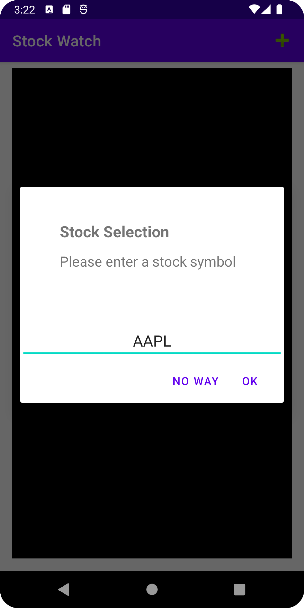
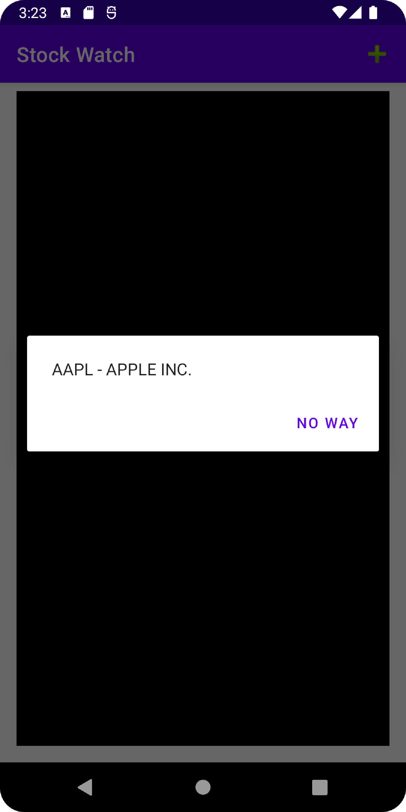
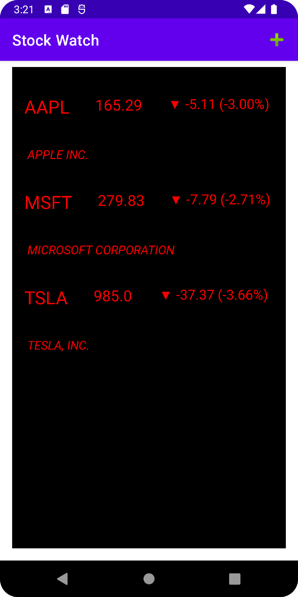

# StockWatch Features

This simple yet useful application invokes several APIs in order to get financial data for stocks in the NYSE stock exchange. The client is able to search keywords which
prompts a list of stocks matching that keyword. 

Clicking on a stock adds that stock to the main screen. Now the client can see the symbol, name, last trade price, and daily change in value of the given stock. 

The app has capability to save the information on the selected stocks to the main screen in between uses. The selected stocks on the screen are updated everytime the app is ran. 

Clicking on a selected stocks takes the client to a webpage containing more detail regarding the stock and its performance over time. 

## Screenshots

  

